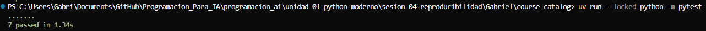
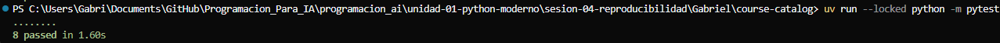
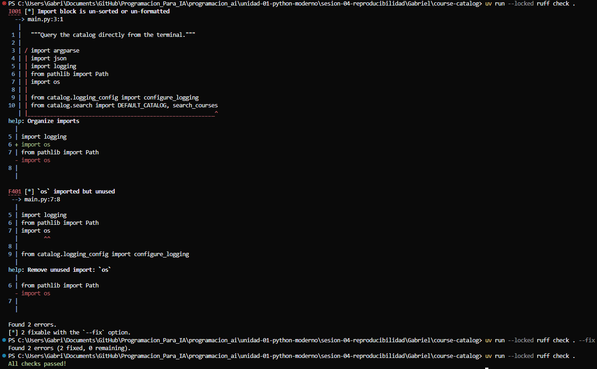
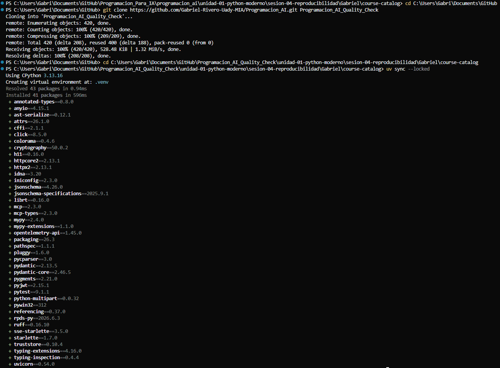
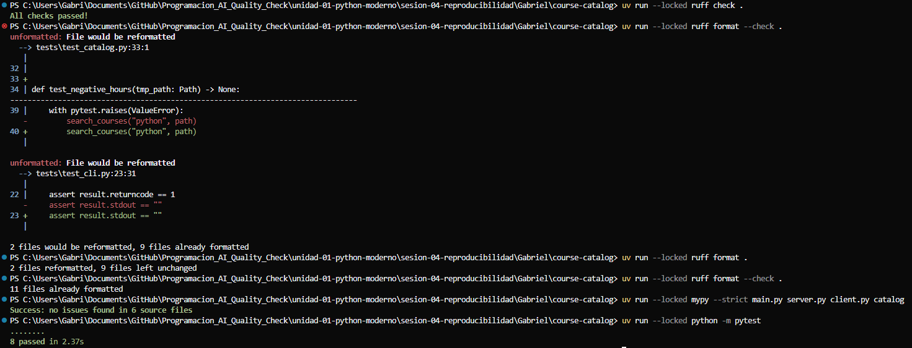

# Práctica · Sesión 4 — Organización y reproducibilidad con uv

## Ejercicio 1 · Punto de entrada

### Comandos

```bash
uv run python -c "import main"
```

### Resultado

El comando no produjo salida en la terminal

### Explicacion

import main no realiza la consulta porque la ejecución del main está dentro de la condición `if __name__ == "__main__"` , cuando usamos `import` el archivo se carga como modulo y python asigna a  `__name__` el valor `"main"`, y el if no se cumple por lo tanto no se ejecuta el `main()`. El caso de server.py es similar, la inicialización de transport ocurre dentro del if, por eso, si se registra `find courses` como herramienta, pero stdio no se inicializa. 

## Ejercicio 2 · Datos y argumentos


### Comandos

```bash
uv run python main.py python --catalog data/extra_courses.json
uv run python main.py python --catalog data/no_existe.json
$LASTEXITCODE
uv run --locked python client.py python
```


### Resultado

El primer comando `--catalog data/extra_courses.json` nos regresa los 3 cursos actuales que contiene coincidencias con `Python`.
La consulta a `--catalog data/no_existe.json` produjo un devolvió el error `FileNotFoundError: [Errno 2] No such file or directory: 'data\\no_existe.json'` y al usar `$LASTEXITCODE` Obtuvimos 1.
La última llamada usando `uv run --locked python client.py python` devuelve los 2 cursos en el catálogo original. 


### Explicacion

Al utilizar el argumento `--catalog`, hacemos que `main.py` utilice un el archivo que le designemos a continuación, en nuestro archivo nuevo `extra_courses.json` existen ahora 3 cursos que coinciden con Python. 
En el ejemplo con una ruta inexistente, `search_courses()` no puede abrir un archivo y se genera una excepción. `main.py` devuelve el error con el código de salida 1. 
Como MCP tiene el catálogo original como predeterminado, cuando se realiza la consulta se utiliza `DEFAULT_CATALOG` que apunta a `data/courses.json` por lo que nos devuelve los unicamente 2 cursos originales. 


## Ejercicio 3 · Niveles y destinos


### Comandos

```bash
uv run python main.py python --log-level DEBUG
uv run python main.py python --log-level INFO
uv run python main.py python --log-level ERROR
uv run python main.py python --log-level ERROR --log-file logs/app.log
```


### Resultado

Al usar `--log-level DEBUG` se obtiene en la terminal mensajes para `DEBUG` y para `INFO` ademas del resultado JSON.
Con `--log-level INFO` solo aparece en la terminal el mensaje para `INFO` y el resultado JSON.
Finalmenete con `--log-level ERROR` no aparecen mensajes en la terminal para `ERROR` porque no existieron errores y se imprime el resultado JSON.
El comando `uv run python main.py python --log-level ERROR --log-file logs/app.log` nuevamente no aparecen mensajes por `ERROR` y se genera un archivo `app.log` que SI guarda mensajes de `DEBUG` y `ERROR.`

### Explicacion

En este ejercicio observamos 2 conceptos trabajando:
`StreamHandler` maneja los mensajes de la consola que se configuran con `--log-level`. dependiendo del nivel seleccionado, se muestran distintos mensajes en la consola. 
`FileHandler` maneja los mensajes que se guardan en archivos y está configurado con el nivel `DEBUG` por eso en el archivo de `app.log` se conservar los niveles inferiores, aunque en la consola se filtren.
`stdout` se debe reservar para el protocolo MCP porque estamos usando `stdio` como transporte. Los mensajes del cliente y el servidor se intercambian en `stdout`. Si enviáramos mensajes a la consola con `print()` que tambien salen por `stdout` podríamos mezclar esos mensajes con el protocolo y corromper la comunicación. por esta razón los logs se envían con `stderr` y reservar `stdout` para el protocolo. 

## Ejercicio 4 · Mejorar el diagnóstico


### Comandos

```bash
uv run python main.py python
uv run --locked python client.py python
```

```python
logger.info(
    "Search completed: %d matches from %d total courses",
    len(matches),
    len(courses),
)
```


### Resultado

La consulta directa mostro el mensaje con los cambios que realizamos, `INFO | catalog.search | Search completed: 2 matches from 3 total courses` y devolvió los cursos `PY01` y `PY02`.
La llamada a MCP devuelve los mismos cursos y termino correctamente pero no mostro el mensaje nuevo. 


### Explicacion

En la llamada MCP el nuevo mensaje `INFO` no forma parte del resultado que se le envía al cliente, este pertenece al sistema de logging del servidor y no a al que devuelve la herramienta.


## Ejercicio 5 · Reproducción y llamada MCP


### Comandos

Se creó una copia limpia del repositorio en: Programacion_AI_Check\unidad-01-python-moderno\sesion-04-reproducibilidad\Gabriel\course-catalog

desde la cual se ejecuto lo siguiente:

```bash
uv sync --locked
uv run --locked python client.py python
uv run --locked python client.py astronomy
uv run --locked python client.py " "
```


### Resultado

El entorno se reconstruyo correctamente utilizando `uv sync --locked`
Al ejecutar `uv run --locked python client.py python` despues de `sync --locked` se descubre la herramienta `find_courses` y obtenemos la respuesta de los 2 cursos `PY01` y `PY02`.
`astronomy` devuelve una lista vacia y devuelve `"is_error": false`.
Sin embargo, la cadena de espacios vacios `"  "`, si produjo un error con `"is_error": true`


### Explicacion¨

`pyproject.toml` declara la configuración principal del proyecto, así como sus dependencias. 
`uv.lock` guarda las versiones de las dependencias para que el entorno se puede reconstruir de manera consistente. 
`.python-version` nos indica la versión de Python que será utilizada en el proyecto.
`.venv` no es necesario entregarlo por es un entorno reconstruible y local. Se genera a partir de los archivos al usar `uv sync --locked`. 
No tener coincidencias es un resultado valido, simplemente se regresa una lista vacía con `"is_error": false`. Por otro lado, una búsqueda con argumento vacío no es válido y nos devuelve el `"is_error": true`.


## Ejercicio 6 · Agrega una prueba de un catálogo cuyo curso tenga horas negativas.


### Comandos

Se agrego este codigo en el archivo `test_catalog.py`

```Python
def test_negative_hours(tmp_path: Path) -> None:
    path = tmp_path / "courses_negative.json"
    path.write_text(
        json.dumps([{"code": "X2", "title": "Python avanzado", "hours": -5}])
    )
    with pytest.raises(ValueError):
        search_courses("python", path)
```
Se ejecutaron los siguientes comandos

```bash
uv run --locked python -m pytest
```

### Resultado

Todas las pruebas pasaron



### Explicacion

El modelo Course define horas como mayor o igual a 0, Pydantic rechazo los valores mejores 0 iguales a cero y la prueba confirma que se comportó de manera adecuada y nos devuelve que todas las pruebas pasaron con éxito. 

## Ejercicio 7 · Agrega una prueba de consola que compruebe código 1 y stdout vacío ante un archivo inexistente. Usa subprocess.run y un directorio temporal de pytest.


### Comandos


[Se creo un archivo nuevo en test/test_cli.py](test/test_cli.py)

Se corrieron los siguientes comandos:
```bash
uv run --locked python -m pytest
```

### Resultado




### Explicacion

La prueba confirma que la instancia termina con código 1 y que stdout queda vacío. con tmp_path se generó una ruta temporal para no depender de los archivos del proyecto. 


## Ejercicio 8 · Introduce un import sin usar, observa la falla de Ruff y corrígelo.


### Comandos

Se agrega en `main.py`:

```Python
import argparse
import json
import logging
from pathlib import Path
import os  ## <-- Agregado sin utilizar
```
Luego se ejecuta:

```bash
uv run --locked ruff check .
```

### Resultado



### Explicacion

Ruff detecto 2 problemas `F401` porque estamos importando algo que no estamos usando y `I001` porque el import está en desorden. Después ejecutamos `ruff check . --fix` que corrigió ambos errores y verificamos, por último, con `uv run --locked ruff check .` y ya obtenemos "All checks passed!".


## Ejercicio 9 · Ejecuta todas las comprobaciones desde una copia limpia.


### Comandos

Se clona el proyecto a otra carpeta limpia: 

```powershell
cd C:\Users\Gabri\Documents\GitHub
git clone https://github.com/Gabriel-Rivero-Uady-MIA/Programacion_AI.git Programacion_AI_Quality_Check
cd C:\Users\Gabri\Documents\GitHub\Programacion_AI_Quality_Check\unidad-01-python-moderno\sesion-04-reproducibilidad\Gabriel\course-catalog
```
Se ejecutan los siguientes comandos para verificar y reconstruir el proyecto:

```bash
uv sync --locked
uv run --locked ruff check .
uv run --locked ruff format --check .
uv run --locked mypy --strict main.py server.py client.py catalog
uv run --locked python -m pytest
```

### Resultado






### Explicacion

Desde la copia limpia del proyecto en `Programacion_AI_Quality_Check` se ejecutó `uv sync --locked` que creo un nuevo `.venv` con todas las dependencias fijas del proyecto. Se ejecutaron entonces las verificaciones y ruff detecto 2 archivos que requerian correccion, se ejecutó `uv run --locked ruff .` y se verifico nuevamente, ruff confirmo 11 archivos correctamente formateados, mypy reporto 0 problemas y pytest completo las 8 pruebas correctamente. 
